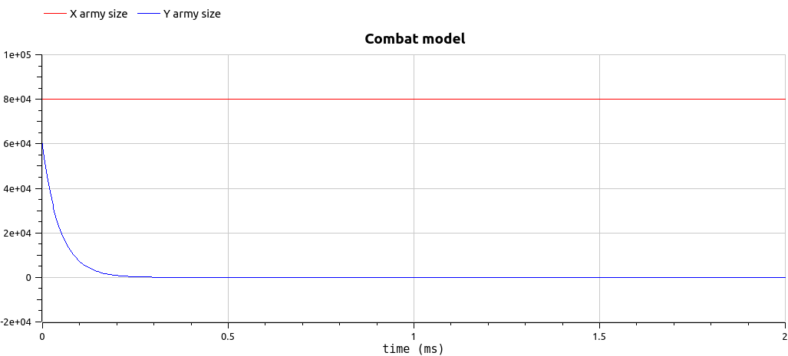

---
## Front matter
lang: ru-RU
title: Лабораторная работа №3
subtitle: Модель боевных действий
author:
  - Van I
institute:
  - Российский университет дружбы народов, Москва, Россия
date: 25.02.2023

## i18n babel
babel-lang: russian
babel-otherlangs: english

## Formatting pdf
toc: false
toc-title: Содержание
slide_level: 2
aspectratio: 169
section-titles: true
theme: metropolis
mainfont: PT Serif 
romanfont: PT Serif 
sansfont: PT Sans
monofont: PT Mono
header-includes:
 - \metroset{progressbar=frametitle,sectionpage=progressbar,numbering=fraction}
 - '\makeatletter'
 - '\beamer@ignorenonframefalse'
 - '\makeatother'
---

# Информация

## Докладчик

:::::::::::::: {.columns align=center}
::: {.column width="70%"}

  * Van I
  * студент НФИбд-02-20
  * Российский университет дружбы народов
  * [1032198069@pfur.ru]

:::
::::::::::::::

# Вводная часть

## Актуальность

- Работа с моделированием ситуации много где применяется
- Работа с графиками - наглядным представлением данных  


## Цели и задачи

- Соделирование боевые действия с помощью Julia и OpenModelica
- Представить результаты в виде графиков проанализировать
- Сравнить Julia и OpenModelica

## Материалы и методы

- Язык `Julia` и ее библиотеки: `Plots` и `DifferentialEquations` для построения графиков
- Свободное открытое программное обеспечение `OpenModelica` для моделирования ситуации
 
# Ход работы

## Построение моделей боя

1. Модель боевых действий между регулярными войсками описывается следующим ОДУ

  dx/dt = - ax(t) - bx(t) + P(t)  
  dy/dt = - cx(t) - hy(t) + Q(t) 
 
2. Модель ведение боевых действий с участием регулярных войск и
партизанских отрядов

  dx/dt = - a(t)x(t) - b(t)x(t) + P(t)  
  dy/dt = - c(t)x(t)y(t) - h(t)y(t) + Q(t)  

где: 
a,b,c,h - постоянные коэффициенты  
a(t), h(t) - коэффициенты, описывающие потери, не связанные с боевыми действиями  
c(t), b(t) - коэффициенты, описывающие потери, связанные с боевыми действиями  
P(t), Q(t) - функции, учитывающие возможность подхода подкрепления к войскам  


## Код для моделирования боя на Julia

```
#variant 50
using Plots
using DifferentialEquations

x0 = 80000
y0 = 60000

a = -0.21
b = -0.855
c = -0.455
h = -0.32

P(t) = sin(t) + 2
Q(t) = cos(t) + 2

function F(du, u, p, t)
    x,y = u
    du[1] = a*u[1] + b*u[2] + P(t)
    du[2] = c*u[1] + h*u[2] + Q(t)
end

u0 = [x0,y0]
tspan = (0.0, 3.0)
pr = ODEProblem(F, u0, tspan)
sol = solve(pr)

xx = [u[1] for u in sol.u]
yy = [u[2] for u in sol.u]
T = [t for t in sol.t]
plott = plot(dpi=500, title = "Combat model", legend=true)
plot!(plott, T, xx, label = "X army size", color=:brown)
plot!(plott, T, yy, label = "Y army size", color=:green)

savefig(plott, "lab3_1jl.png")
```

## Полученный график первой модели боя

{#fig:002 heigh=90% width=70%}

## Полученный график второй модели 

{#fig:003 heigh=90% width=70%}

## Код для моделирования первого боя на OpenModelica

```
model lab3_1
parameter Integer x0 = 80000;
parameter Integer y0 = 60000;

parameter Real a = -0.21;
parameter Real b = -0.855;
parameter Real c = -0.455;
parameter Real h = -0.32;
Real x(start=x0);
Real y(start=y0);
equation
der(x) = a*x + b*y + sin(time) + 2;
der(y) = a*x + b*y + cos(time) + 2;
end lab3_1;
```

## Код для моделирования второго боя на OpenModelica

```
model lab3_2
parameter Integer x0 = 80000;
parameter Integer y0 = 60000;

parameter Real a = -0.267;
parameter Real b = -0.687;
parameter Real c = -0.349;
parameter Real h = -0.491;
Real x(start=x0);
Real y(start=y0);
equation
der(x) = a*x + b*y + abs(sin(2*time));
der(y) = a*x*y + b*y + abs(2*cos(time));
end lab3_2;
```

## График первой модели 

{#fig:008 heigh=90% width=70%}

## График второй модели

{#fig:009 heigh=90% width=70%}

# Результаты
## Результаты выполнения

- В результате моделирования были получены графики и навыки работы с ними
- Ознакомление с языками
- Сравнение Julia и OpenModelica


