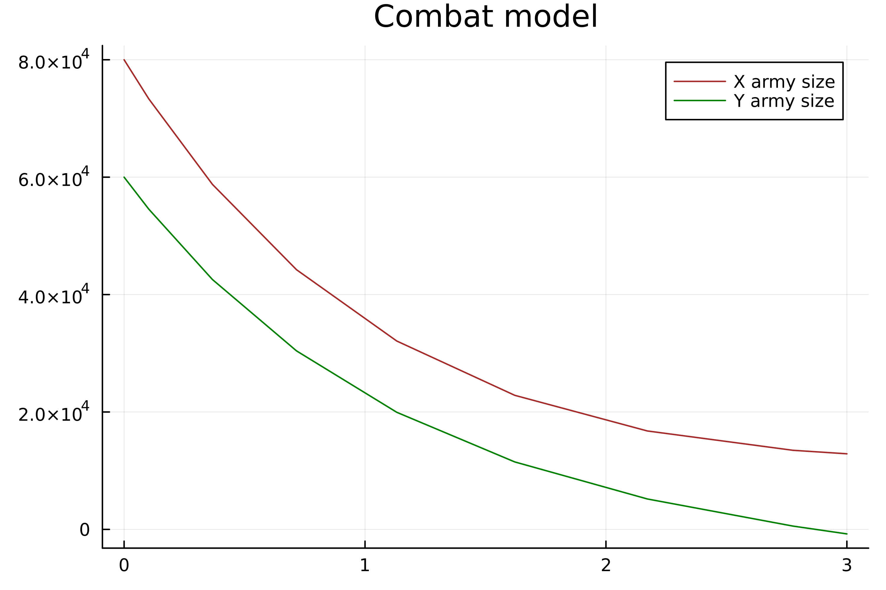
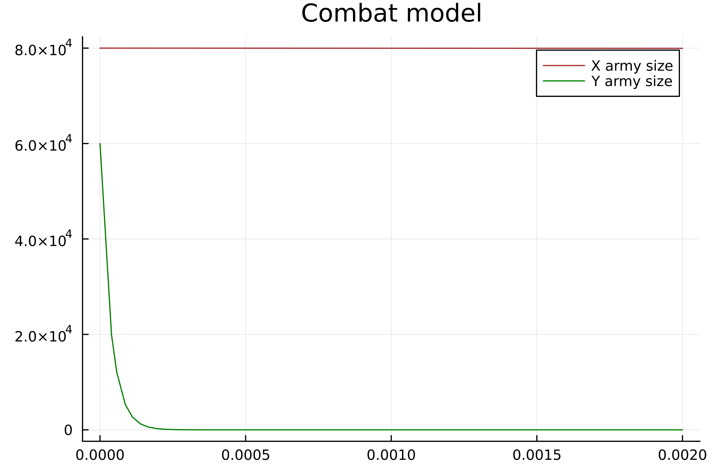
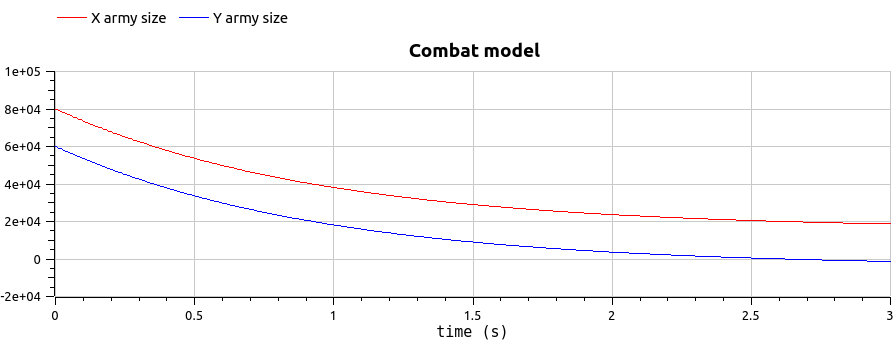
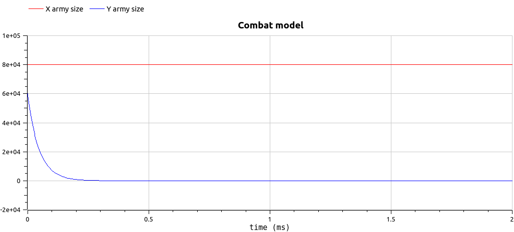

---
## Front matter
title: "Отчёт по лабораторной работе №3"
subtitle: "Модель боевых действий"
author: "Van I"

## Generic otions
lang: ru-RU
toc-title: "Содержание"

## Bibliography
bibliography: bib/cite.bib
csl: pandoc/csl/gost-r-7-0-5-2008-numeric.csl

## Pdf output format
toc: true # Table of contents
toc-depth: 2
lof: true # List of figures
lot: true # List of tables
fontsize: 12pt
linestretch: 1.5
papersize: a4
documentclass: scrreprt
## I18n polyglossia
polyglossia-lang:
  name: russian
  options:
	- spelling=modern
	- babelshorthands=true
polyglossia-otherlangs:
  name: english
## I18n babel
babel-lang: russian
babel-otherlangs: english
## Fonts
mainfont: PT Serif
romanfont: PT Serif
sansfont: PT Sans
monofont: PT Mono
mainfontoptions: Ligatures=TeX
romanfontoptions: Ligatures=TeX
sansfontoptions: Ligatures=TeX,Scale=MatchLowercase
monofontoptions: Scale=MatchLowercase,Scale=0.9
## Biblatex
biblatex: true
biblio-style: "gost-numeric"
biblatexoptions:
  - parentracker=true
  - backend=biber
  - hyperref=auto
  - language=auto
  - autolang=other*
  - citestyle=gost-numeric
## Pandoc-crossref LaTeX customization
figureTitle: "Рис."
tableTitle: "Таблица"
listingTitle: "Листинг"
lofTitle: "Список иллюстраций"
lotTitle: "Список таблиц"
lolTitle: "Листинги"
## Misc options
indent: true
header-includes:
  - \usepackage{indentfirst}
  - \usepackage{float} # keep figures where there are in the text
  - \floatplacement{figure}{H} # keep figures where there are in the text
---

# Цель работы

- Построение модели боевых действий на языках Julia и OpenModelica. 
- Решение ОДУ 1 порядка с помощью графика. 
- Рассмотрение модели боевных действий между регулярными войсками. 
- Рассмотрение модели ведения боевых действий с участием регулярных войск и партизанских отрядов.

# Задание

Существуют три модели боя.

1. Модель боевых действий между регулярными войсками

2. Модель ведение боевых действий с участием регулярных войск и
партизанских отрядов

3. Модель боевых действий между партизанскими отрядами

В нашей работе мы рассмотрим только первых две модели.

Проверим, как работает модель в различных ситуациях, постройте графики y(t) и x(t) в рассматриваемых случаях.

# Теоретическое введение

1. Модель боевых действий между регулярными войсками описывается следующим ОДУ

>dx/dt = - ax(t) - bx(t) + P(t)  
>dy/dt = - cx(t) - hy(t) + Q(t)  

2. Модель ведение боевых действий с участием регулярных войск и
партизанских отрядов

>dx/dt = - a(t)x(t) - b(t)x(t) + P(t)  
>dy/dt = - c(t)x(t)y(t) - h(t)y(t) + Q(t)  

где: 
>a,b,c,h - постоянные коэффициенты  
>a(t), h(t) - коэффициенты, описывающие потери, не связанные с боевыми действиями  
>c(t), b(t) - коэффициенты, описывающие потери, связанные с боевыми действиями  
>P(t), Q(t) - функции, учитывающие возможность подхода подкрепления к войскам  

Подробнее о модели боевых действий в [@esystem-lab3;@lanchester]

# Выполнение лабораторной работы

Напишем код на Julia с помощью средств языка и библиотек Plots и DifferentialEquations. Решаем наши ОДУ [@openmodelicaODE] , строим график.

1)

```julia
#variant 50
using Plots
using DifferentialEquations

x0 = 80000
y0 = 60000

a = -0.21
b = -0.855
c = -0.455
h = -0.32

P(t) = sin(t) + 2
Q(t) = cos(t) + 2

function F(du, u, p, t)
    x,y = u
    du[1] = a*u[1] + b*u[2] + P(t)
    du[2] = c*u[1] + h*u[2] + Q(t)
end

u0 = [x0,y0]
tspan = (0.0, 3.0)
pr = ODEProblem(F, u0, tspan)
sol = solve(pr)

xx = [u[1] for u in sol.u]
yy = [u[2] for u in sol.u]
T = [t for t in sol.t]
plott = plot(dpi=500, title = "Combat model", legend=true)
plot!(plott, T, xx, label = "X army size", color=:brown)
plot!(plott, T, yy, label = "Y army size", color=:green)

savefig(plott, "lab3_1jl.png")
```
2)

```julia
#variant 50
using Plots
using DifferentialEquations

x0 = 80000
y0 = 60000

a = -0.267
b = -0.687
c = -0.349
h = -0.491

P(t) = abs(sin(2*t))
Q(t) = abs(2*cos(t))

function F(du, u, p, t)
    x,y = u
    du[1] = a*u[1] + b*u[2] + P(t)
    du[2] = c*u[1]*u[2] + h*u[2] + Q(t)
end

u0 = [x0,y0]
tspan = (0.0, 0.002)
pr = ODEProblem(F, u0, tspan)
sol = solve(pr)

xx = [u[1] for u in sol.u]
yy = [u[2] for u in sol.u]
T = [t for t in sol.t]
plott = plot(dpi=500, title = "Combat model", legend=true)
plot!(plott, T, xx, label = "X army size", color=:brown)
plot!(plott, T, yy, label = "Y army size", color=:green)

savefig(plott, "lab3_2jl.png")
```
Первый полученный график показывает нам - численность армии Y проигрывает (рис. @fig:002).

{#fig:002 width=70%}

На втором графике проигрывает армия Y.

{#fig:003 width=70%}

Дальше переходим к написанию кода на OpenModelica. 
1) Первая модель.
```
model lab3_1
parameter Integer x0 = 80000;
parameter Integer y0 = 60000;

parameter Real a = -0.21;
parameter Real b = -0.855;
parameter Real c = -0.455;
parameter Real h = -0.32;
Real x(start=x0);
Real y(start=y0);
equation
der(x) = a*x + b*y + sin(time) + 2;
der(y) = a*x + b*y + cos(time) + 2;
end lab3_1;
```

2)
```
model lab3_2
parameter Integer x0 = 80000;
parameter Integer y0 = 60000;

parameter Real a = -0.267;
parameter Real b = -0.687;
parameter Real c = -0.349;
parameter Real h = -0.491;
Real x(start=x0);
Real y(start=y0);
equation
der(x) = a*x + b*y + abs(sin(2*time));
der(y) = a*x*y + b*y + abs(2*cos(time));
end lab3_2;
```

Настраиваем нашу симуляцию.

Получаем наши графики моделей боя (рис. @fig:007) (рис. @fig:008).

Графики похожи на графики в Julia, значит, мы сделали все верно. Исходы боя получили аналогичным на Julia.

{#fig:007 width=70%}

{#fig:008 width=70%}

# Выводы

В ходе лабораторной работы были получены навыки работы с простейшими моделями боетвий. Укрепили наши навыки работы на Julia и OpenModelica. Результат работы - графики, наглядко показывающие результат. если сравнивать эти языки программирования, то для решения этой задачи мне понравился OpenModelica. Просто, наглядно, быстро и много интересных настроек, которые легко менять для изучения ситуации.


# Список литературы{.unnumbered}

