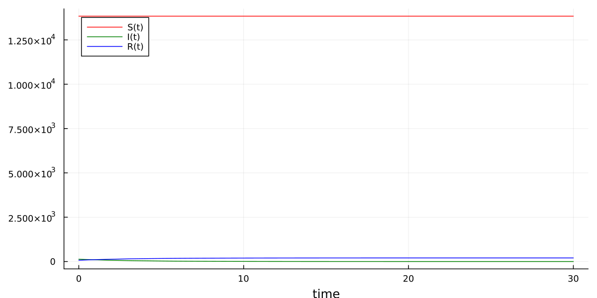
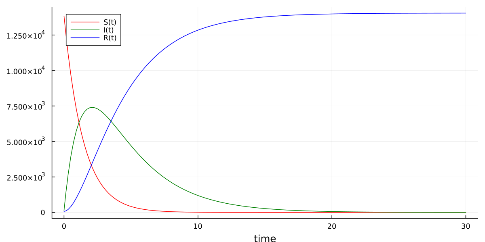
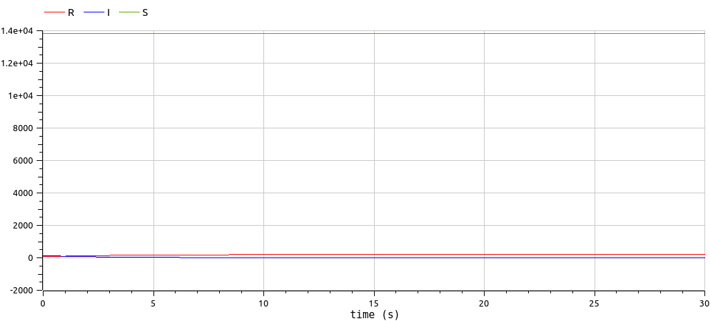

---
## Front matter
lang: ru-RU
title: Лабораторная работа №6
subtitle: Задача об эпидемии
author:
  - Ван И
institute:
  - Российский университет дружбы народов, Москва, Россия
date: 18 марта 2023

## i18n babel
babel-lang: russian
babel-otherlangs: english

## Fonts
mainfont: PT Serif
romanfont: PT Serif
sansfont: PT Sans
monofont: PT Mono
mainfontoptions: Ligatures=TeX
romanfontoptions: Ligatures=TeX
sansfontoptions: Ligatures=TeX,Scale=MatchLowercase
monofontoptions: Scale=MatchLowercase,Scale=0.9

## Formatting pdf
toc: false
toc-title: Содержание
slide_level: 2
aspectratio: 169
section-titles: true
theme: metropolis
header-includes:
 - \metroset{progressbar=frametitle,sectionpage=progressbar,numbering=fraction}
 - '\makeatletter'
 - '\beamer@ignorenonframefalse'
 - '\makeatother'
---

# Информация

## Докладчик

:::::::::::::: {.columns align=center}
::: {.column width="70%"}

  * Ван И
  * студент уч. группы НФИбд-02-20
  * Российский университет дружбы народов
  * [1032198069@pfur.ru]

:::
::::::::::::::

# Вводная часть

## Актуальность

- Необходимость навыков моделирования реальных математических задач, построение графиков.

## Объект и предмет исследования

- Язык программирования Julia
- Язык моделирования Modelica
- Измененная математическая модель SIR

## Цели и задачи

- Продолжить знакомство с функционалом языков Julia и Modelica.
- Описать измененную математическую модель SIR с помощью данных языков.
- Построить графики состояния систем в соответствии с поставленными задачами.

## Материалы и методы

- Языки:
  - язык программирования Julia
  - язык моделирования Modelica
- Дополнительный комплекс программ:
  - Программное обеспечение OpenModelica

# Процесс выполнения работы

# Формулировка задания

На одном острове вспыхнула эпидемия. Известно, что из всех проживающих на острове ($N=14041$) в момент начала эпидемии ($t=0$) число заболевших людей (являющихся распространителями инфекции) $I(0)=131$, А число здоровых людей с иммунитетом к болезни $R(0)=71$. Таким образом, число людей восприимчивых к болезни, но пока здоровых, в начальный момент времени $S(0)=N-I(0)- R(0)$.

Постройте графики изменения числа особей в каждой из трех групп. Рассмотрите, как будет протекать эпидемия в случае:

1. Если $I(0) \le I^*$

2. Если $I(0) > I^*$

# Теоретическое введение
## Теоретическое введение 1
Измененная математическая модель SIR описывается следующей системой ОДУ:

$$
\frac{dS}{dt} = 
\left\{
\begin{array}{c}
-\alpha S, \ если \ I(t)> I^*
 \\
0, \ если \ I(t) \le I^*
\end{array}
\right.
$$

$$
\frac{dI}{dt} = 
\left\{
\begin{array}{c}
\alpha S - \beta I, \ если \ I(t)> I^*
 \\
- \beta I, \ если \ I(t) \le I^*
\end{array}
\right.
$$

$$ \frac{dR}{dt} = \beta I, $$

## Теоретическое введение 2

где $S(t)$ — численность восприимчивых индивидов в момент времени $t$; $I(t)$ — численность инфицированных индивидов в момент времени $t$; $R(t)$ — численность переболевших индивидов в момент времени $t$; $I^*$ — критическое значение $I(t)$, после превышения которого инфицированные способны заражать восприимчивых, до этого критического значения инфицированные не заражают восприимчивых; $\alpha$ — коэффициент заболеваемости;  $\beta$ — коэффициент выздоровления.

# Julia
## Получившийся график задания №1. 

:::::::::::::: {.columns align=top}
::: {.column width="70%"}

:::
::::::::::::::

## Получившийся график задания №2. 

:::::::::::::: {.columns align=center}
::: {.column width="70%"}

:::
::::::::::::::

# OpenModelica
## Получившийся график №1.

:::::::::::::: {.columns align=center}
::: {.column width="70%"}

:::
::::::::::::::

## Получившийся график №2.

:::::::::::::: {.columns align=center}
::: {.column width="70%"}

:::
::::::::::::::

# Результаты

- Описана измененную математическую модель SIR с помощью языков Julia и Modelica.
- Построены графики состояния систем в соответствии с поставленными задачами.

## Вывод

Продолжил знакомство с функционалом языка программирования Julia и языка моделирования Modelica, а также с функционалом программного обеспечения OpenModelica. Используя эти средства, построил измененную математическую модель SIR.
